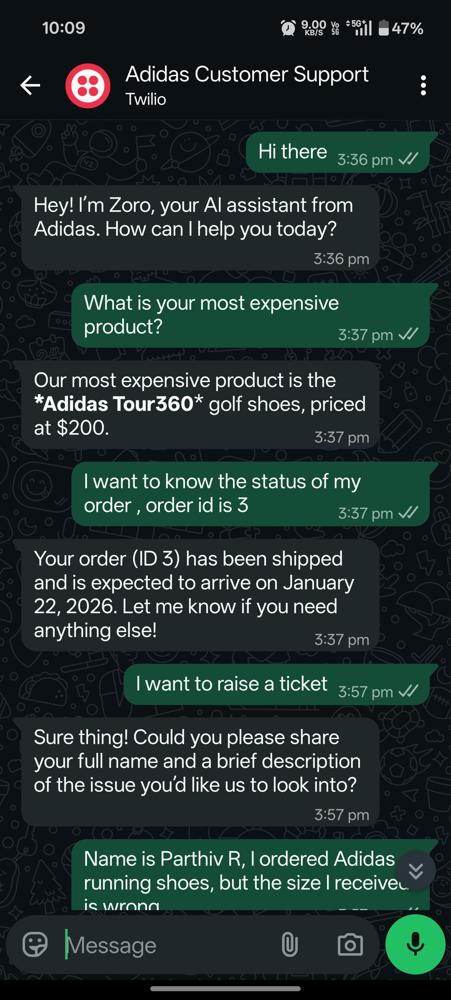

# 🤖  Adidas Customer Support -Agentic AI (n8n + Twilio + Groq)

An end-to-end AI-powered WhatsApp customer support system built using n8n, Twilio WhatsApp Sandbox, and a Groq-hosted LLM.  
The system can answer FAQs, track orders, and raise support tickets automatically through a conversational WhatsApp interface.

---

## 📸 Screenshots

### 🔹 Archetecture Flow

### 🔹 Chat Screenshots

## 🚀 Features
- WhatsApp-based customer interaction (via Twilio)
- AI Agent for natural language understanding
- Order status lookup
- Ticket creation for customer issues
- Policy-based responses (e.g. return policy)
- LLM-powered reasoning via Groq

---

## 🏗️ Architecture Overview
WhatsApp (User) → Twilio WhatsApp Webhook → n8n Workflow → AI Agent (Groq LLM) → Business Logic (Policies / Orders / Tickets) → Twilio → WhatsApp (Response)

---

## 🧰 Tech Stack
- n8n – Workflow orchestration & automation
- Twilio WhatsApp Sandbox – Messaging channel
- Groq LLM – AI reasoning & response generation
- Airtable – Used as a database tool for storing orders, tickets, and agent-generated records
- Docker – Local self-hosted setup
- ngrok – Public webhook tunneling (local development)

---

## 🧠 AI Capabilities
The AI agent can:
- Answer product and pricing questions
- Provide return & refund policy details
- Track order status using order ID
- Collect user details and raise support tickets
- Respond conversationally like a real support agent
- Stores and retrieves structured data using Airtable as an agent tool

---

## 📂 Project Structure
.
├── workflows/
│   └── whatsapp-ai-agent-workflow.json
├── README.md
└── .gitignore

---

## ⚙️ Setup Instructions (Local)

1. Run n8n using Docker  
   docker run -it -p 5678:5678 -v n8n_data:/home/node/.n8n n8nio/n8n  

2. Access n8n at  
   http://localhost:5678  

3. Expose n8n via ngrok  
   ngrok http 5678  

4. Configure Twilio WhatsApp Sandbox  
   - Join the WhatsApp sandbox using the provided join code  
   - Set the webhook URL to  
     https://<ngrok-url>/webhook/<n8n-webhook-id>  

5. Import the workflow JSON into n8n  
6. Configure credentials (Twilio, Groq)  
7. Publish the workflow  

---

## 🔐 Security Notes
- API keys and sensitive credentials are not included in this repository
- Secrets such as Twilio tokens and Groq API keys are managed securely using n8n credentials
- Placeholder values are used in the workflow JSON where required
- Environment variables should be configured locally and never committed to GitHub
- This project follows basic security best practices for demo and portfolio use

---

## 📸 Demo Use Cases
- What is your return policy?
- Where is my order? 
- I want to raise a ticket
- My shoe size is incorrect
- My delivery is delayed

---

## 👨‍💻 Author
Parthiv R  
AI & Automation Enthusiast  

Built as a hands-on project to explore agentic workflows, LLM integration, and real-world automation.

---

## ⭐ Acknowledgements
- n8n community
- Twilio developer platform
- Groq LLM ecosystem
